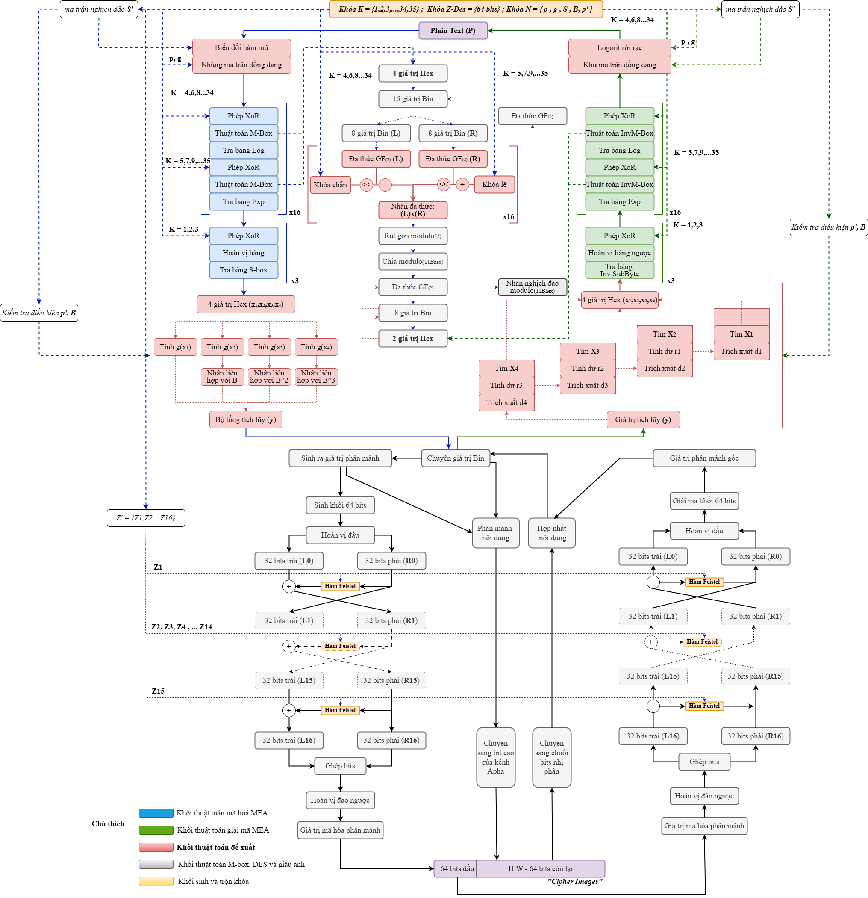

<h2 align="center">
  Author: Huynh Thanh Phong (ReoRioll)
</h2>

<p align="center">
   Computer Science of College of Information and Communication Technology of Can Tho University (Course 48)<br>
</p>

<p>
&nbsp;&nbsp;&nbsp;&nbsp;&nbsp;&nbsp;&nbsp;&nbsp;&nbsp;&nbsp;&nbsp;&nbsp;&nbsp;&nbsp;&nbsp;&nbsp;&nbsp;&nbsp;
<b>Researchs:</b> Artificial Intelligence in Education - Mathematics in Deep Learning and Machine Learning<br>

&nbsp;&nbsp;&nbsp;&nbsp;&nbsp;&nbsp;&nbsp;&nbsp;&nbsp;&nbsp;&nbsp;&nbsp;&nbsp;&nbsp;&nbsp;&nbsp;&nbsp;&nbsp;
<mark><b><b>Name Project:</b></b> </mark> Modular Encryption Algorithm for Game Question Authentication<br>

&nbsp;&nbsp;&nbsp;&nbsp;&nbsp;&nbsp;&nbsp;&nbsp;&nbsp;&nbsp;&nbsp;&nbsp;&nbsp;&nbsp;&nbsp;&nbsp;&nbsp;&nbsp;
<mark><b><b>Update Research:</b></b> </mark> Modular Encryption Algorithm for Improved Secure Data Transmission<br>

&nbsp;&nbsp;&nbsp;&nbsp;&nbsp;&nbsp;&nbsp;&nbsp;&nbsp;&nbsp;&nbsp;&nbsp;&nbsp;&nbsp;&nbsp;&nbsp;&nbsp;&nbsp;
<b>Timeline:</b> 03/2025 – 08/2026 at Computer science department
</p>
<p align="center">
   <b>Presional link Information</b>
</p>

<p>
&nbsp;&nbsp;&nbsp;&nbsp;&nbsp;&nbsp;&nbsp;&nbsp;&nbsp;&nbsp;&nbsp;&nbsp;&nbsp;&nbsp;&nbsp;&nbsp;&nbsp;&nbsp;
Facbook: https://www.facebook.com/huynh.thanh.phong.561667 <br>

&nbsp;&nbsp;&nbsp;&nbsp;&nbsp;&nbsp;&nbsp;&nbsp;&nbsp;&nbsp;&nbsp;&nbsp;&nbsp;&nbsp;&nbsp;&nbsp;&nbsp;&nbsp;
Kaggle: https://www.kaggle.com/reorioll <br>

&nbsp;&nbsp;&nbsp;&nbsp;&nbsp;&nbsp;&nbsp;&nbsp;&nbsp;&nbsp;&nbsp;&nbsp;&nbsp;&nbsp;&nbsp;&nbsp;&nbsp;&nbsp;
Youtobe: https://www.youtube.com/@ReoRioll-2304CICTCTU <br>
</p>
<br>

<h3 align="left">
  <span style="color:#8B4513;">
    <b>Clone the code from Git and proceed with testing.</b>
  </span>
</h3>

<p>
  Step 1. Clone module from git
</p>

```python
!git clone https://github.com/huynhthanhphong231004IT/Modular_Encryption_Algorithm_for_Improved_Secure_Data_Transmission.git
```
<p>
  Step 2. Import the MEA-GQA model.
</p> 

```python
from MEA_GQA.MEA_GQA import MEA_GQA
```

<p>
  Step 3. Generate a secret key for the algorithm.
</p>

```python
MEA_GQA.Create_Key()
```

<p>
  Step 4. Encrypt the data.
</p>

```python
stego_result_dir = MEA_GQA.Encryption_MEAGQA(
      input_txt_path=input_text_file,
      input_covers_dir=input_covers_folder,
      output_stego_dir=output_stego_folder)
```

<p>
  Step 5. Decrypt the data.
</p>

```python
MEA_GQA.Decoding_MEAGQA(output_stego_folder)
```


> [!NOTE]
> **`input_text_file`**: The path to the input text file containing the data or secret message you want to encrypt or hide.
>
> **`input_covers_folder`**: The path to the folder containing the source image files used to hide secret data.
>
> **`output_stego_folder`**: The path to the folder containing the destination image files with hidden information.


<h3 align="left">
  <span style="color:#8B4513;">
    <b>Theoretical framework of the proposed study</b>
  </span>
</h3>

<h2 align="center">
  <span style="color:#8B4513;">
    <b>Mô hình mã hóa mô - đun trên dữ liệu đường truyền cải tiến (MEA-GQA)</b>
  </span>
</h2>

<p align="center">
  
  <br>
  <i>Kiến trúc mô hình mã hóa mô - đun trên dữ liệu đường truyền cải tiến (MEA-GQA) </i>
</p>

<p align="center">
  
  <br>
  <i>Kiến trúc mô hình mã hóa mô-đun trên dữ liệu đường truyền cải tiến (MEA-GQA)</i>
</p>

## Đóng góp chính của đề tài

Nghiên cứu này kế thừa cấu trúc nền tảng của thuật toán MEA (Modular Encryption Algorithm) của IJSRNSC - Author: P.Sri Ram Chandra, G. Venkateswara Rao, G.V. Swamy và đề xuất các cải tiến nhằm nâng cao độ an toàn mật mã (bằng việc mở rộng trường khóa) cũng như tối ưu hóa khả năng ứng dụng trong lĩnh vực giấu tin ảnh số. Các đóng góp chính bao gồm:

1. Cải tiến cơ chế hoán vị ban đầu trên trường hữu hạn:
   * Thay thế cơ chế hoán vị cố định của MEA gốc bằng phép biến đổi tuyến tính trên trường hữu hạn, kết hợp ma trận khả nghịch và phần tử sinh.
   * Hiệu quả: Mở rộng đáng kể không gian khóa, tăng tính ngẫu nhiên của quá trình hoán vị và nâng cao khả năng chống phân tích tuyến tính nhờ duy trì tính đơn ánh của phép ánh xạ.

2. Trộn dữ liệu qua các phép XOR cùng giải thuật M-Box:
   * Hòa trộn và che giấu cấu trúc dữ liệu thông qua phép XOR với ma trận khóa, kết hợp các phép ánh xạ Logarithm, Exponentials và Substitution Box.
   * Hàm M-Box: Xây dựng cơ chế ánh xạ phi tuyến biến 4 giá trị hexadecimal thành 2 giá trị hexadecimal, không tồn tại phép nghịch đảo, dựa trên các phép toán trên trường Galois ($GF$).

3. Tầng hoán vị phi tuyến bậc hai sau mã hóa:
   * Áp dụng phép biến đổi phi tuyến ngay sau khi tạo bản mã bằng MEA để tăng cường tính hỗn loạn (confusion) và khả năng khuếch tán (diffusion).
   * Hiệu quả: Phá vỡ các quan hệ tuyến tính còn tồn tại trong bản mã, làm gia tăng độ phức tạp của cấu trúc mã hóa và nâng cao khả năng chống lại các phương pháp phân tích mật mã (cryptanalysis).

4. Tích hợp cơ chế giấu tin ảnh RGBA sử dụng LSB kết hợp DES:
   * Mô hình bảo vệ đa lớp: Phân mảnh bản mã và nhúng trực tiếp vào kênh Alpha của ảnh RGBA.
   * Quản lý dữ liệu: Thông tin tiêu đề (header) của mỗi ảnh được mã hóa bằng thuật toán DES để quản lý chính xác số lượng và thứ tự các phân đoạn.
   * Cơ chế nhúng: Nhúng dữ liệu theo quy tắc mã hóa 3 mức trên giá trị Alpha, giúp bảo đảm khôi phục dữ liệu chính xác $100\%$, duy trì chất lượng thị giác của ảnh mang tin (cover image) và tăng cường độ an toàn trong lưu trữ cũng như truyền tải.


